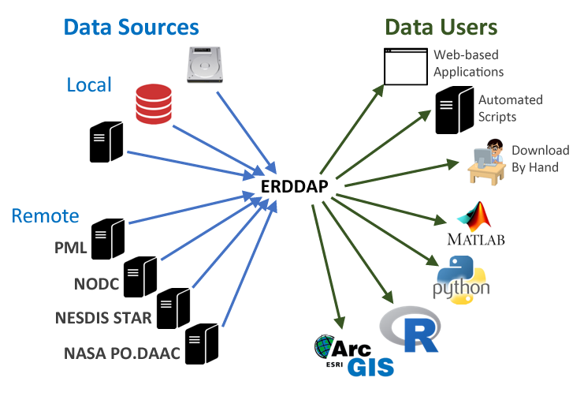
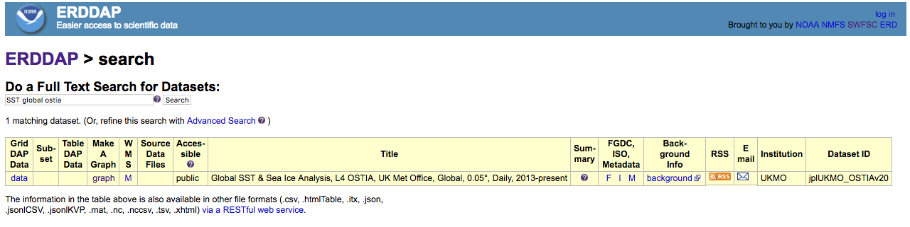
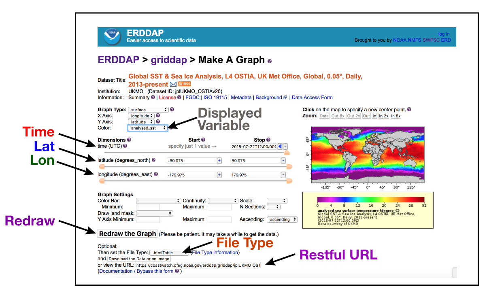
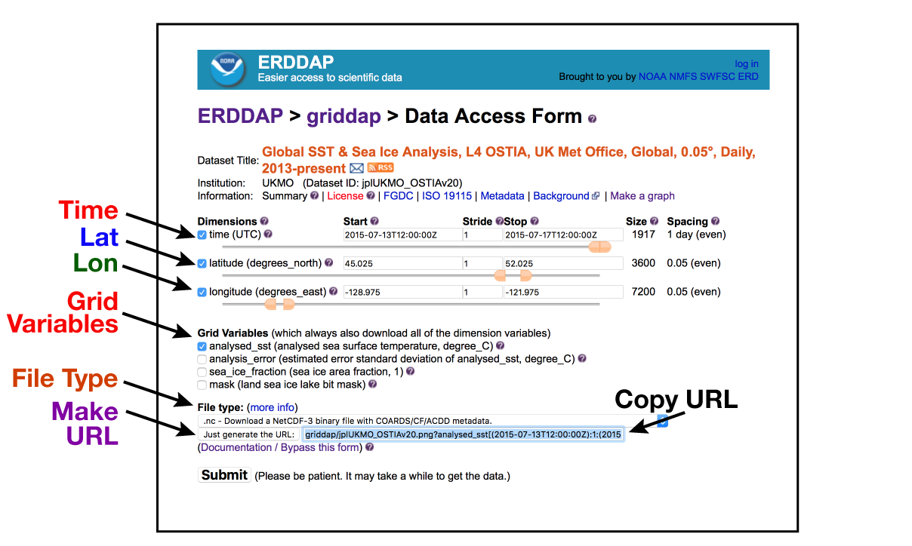

# Navigating ERDDAP {#navigation}
>notebook filename | 02-Navigating.Rmd  

## What is ERDDAP

For many users, obtaining the ocean satillite data they need requires downloading data from several data providers, each with its own file formats, download protocols, subset abilities, and preview abilities.
   
> **A short list of ocean satillite data providers**   
Jet Propulsion Laboratory PO.DAAC  
Ocean Biology (OB.DAAC)  
Goddard Space Flight Center  
Center for Satellite Applications and Research  
CoastWatch Central Operations  
Office of Satellite and Products  
National Centers for Environmental Information  
Comprehensive Large Array-data Stewardship System  
European Space Agency  
Japan Aerospace Exploration Agency   


The goal behind ERDDAP is to make it easier for you to get scientific data. To accomplish that goal, ERDDAP acts as a middleman, selectively channeling datasets from remote and local data sources to a single data portal. With ERDDAP as the single-source portal, you have access to a simple, consistent way to download subsets of gridded and tabular scientific datasets in common file formats, with options and make graphs and maps.

  

** Features of ERDDAP**  

* Data in the common file format of your choice. ERDDAP offers all data as .html table, ESRI .asc and .csv, Google Earth .kml, OPeNDAP binary, .mat, .nc, ODV .txt, .csv, .tsv, .json, and .xhtml  

* ERDDAP can also return a .png or .pdf image with a customized graph or map  

* Standardized  dates/times ("seconds since 1970-01-01T00:00:00Z" in UTC)  

* A graphical interface for humans with browsers   

* RESTful web services for machine-to-machine data exchange and downloading data directly into your software applications (e.g.Matlab, R, Python...) and even into web pages.  


## Finding datasets on ERDDAP
There are many ERDDAP servers to chose from. For this example, we will use the ERDDAP operative by the CoastWatch West Coast Node. 
Enter the following URL into your browser: `https://coastwatch.pfeg.noaa.gov/erddap/`  
or Google `"ERDDAP west coast"`.  
  
* To view all the available datasets, click "View a List of All 1,429 Datasets"  
You will see all 1400+ datasets listed on the page. You don't have to look through them all. There is a search feature to help find datasets on interests.  

* Us the back button on your browser to go back to the landing page (`https://coastwatch.pfeg.noaa.gov/erddap/`)   
* In the search box type "sst" and click the "Search' button.  
Now the choices are narrowed down a little.

* Now add "global' to the search box [i.e. sst and global] and click the "Search' button.  
That further narrows the choices down to SST datasets that have global coverage  

## Explore the information about a dataset. 

* For this example we will use the global SST & Sea Ice Analysis (OSTIA) from the UK Met Office. Add "ostia" in the search box (e.g. sst global ostia) and click the "Search' button.  In the results you should several datasets, including the one displayed below.  

  

* The listing (pictured above) gives access to a lot of information about the dataset. In a browser, try the following:
    *  Mouse over the question mark `?` under `"Summary"` to get an overview of the dataset.
    *  Click `"background"` to get more complete information from the data provider about the dataset. Now go back to the search results page. 
    *  Click the `"M"` under `"FGDC,ISO,Metadata"` to see all of the dataset metadata. A lot of information is displayed. Some important fields are:
       *  `"geospatial_lat_min"`, `"geospatial_lat_max"`, `"geospatial_lon_min"`, and `"geospatial_lon_max"` for the spatial coverage
       *  `"geospatial_lat_resolution"` and `"geospatial_lon_resolution"` for the size of each pixel
       *  `"time_coverage_start"` and `"time_coverage_end"` for the temporal coverage
       *  `"references"` for citing the dataset in publications
       *  `"license"` for restrictions on using the data 
       *  `"acknowledgement"` oftern used to describe how to acknowledge use of the dataset 
       *  `"creator_name"` for the entity that created the dataset
       
*  When you are finished exploring the metadata, go back to the search results page.  
 
  
    
#### On this page, you can explore and view the dataset by using the control widgets
* __"Color" widget__ - This widget has a misleading name. Use it to select the variable that displays on the map. By default `"analysed_sst"` is displayed. Click on the dropdown menu to see the other choices. Try selecting `"sea_ice_fraction"` and watch how the map changes. When you are done, reselect `"analysed_sst"`.
* __"time (UTC)" widget__ - Use it to select the date of interest. By default it is set on the most recent date. There are several ways to select a different date.  
    * With the slider bar, pulling the slider all the way to the left takes you to the first date entry in the dataset or any date in between. Take the slider and select a date midway on the slider bar. Click "Redraw the Graph" to display the new map. 
    * On the date display (under the "Stop" column), clicking the minus (`"-"`) or plus (`"+"`) takes you one day back or forward. Clicking the solid blue left-pointing arrow takes you to the first date entry in the dataset. Clicking the solid blue right-pointing arrow takes you to the most recent entry in the dataset. 
    * Try typing a date, e.g. 2018-06-15T12:00:00Z, directly into the date display. Then click "Redraw the Graph".
* __"latitude" and 'longitude' widgets__ - These widgets work like the time widget, except that you can set with minimum and maximum values with the slider, the `"-"` and `"+"` buttons, and the solid blue left- and right-pointing arrows. 


### Subsetting the dataset
#### Select an area off of the Washington coast 
* Put in the following minimum and maximum latitude and longitude values using the widgets.   
    * `Latitudes: 45, 52`
    * `Longitudes: -129, -122`  

Then click "Redraw the Graph". 
* Next, select a time of July 15, 2015 (`2015-07-15T12:00:00Z`). Then click the `"Redraw the Graph"` button.  

#### There is very little difference in the map color, so adjust the map color scale. 
* In the "Graph Settings" under  "Color Bar", 
    * for "Minimum" input `12` 
    * for "Maximum" input `20` 
    * Then click the `"Redraw the Graph"` button
* You can even change the color palette. 
    * Click the dropdown next to `"Color Bar"` to see a selection of palettes. 
    * The palettes beginning with `"KT"` are designed to show certain parameters best and with ADA compliance. Select the `KT_thermal palette`, which is designed for temperature maps, and click `"Redraw the Graph"`.  
    
## Getting Data From ERDDAP
### Accessing the data
#### You can request the data in many formats
1. Find the dropdown box below the "Redraw the Graph" button that is labeled `"File Type"`. Click on the dropdown box to view a list of about 30 file formats. Some of the most useful for data files are:
    * .nc - netCDF files
    * .mat - Matlab files
    * .json - JSON format
* Image files are available, too
    * .png, .smallPng, .largePng, transparentPng
    * .geotif
    * .ppdf, .smallPdf, .largePdf  
* A full description of file types can be found here: https://coastwatch.pfeg.noaa.gov/erddap/griddap/documentation.html    
    
For demonstration purposes, select `".largePng"` and continue with the next section *Downloading the data*


### Downloading the data
* You can download the data directly to your computer by clicking "Download the Data or an image"
* Alternatively, you can copy the URL in the "or view the URL" box. This URL contains the complete request of the data as you defined it. Put the URL in any browser to download the data. You can even send the URL to a colleague and they can download the data. More importantly, you can use the URL to import the data directly into analysis programs like R, Python, or Matlab. 
* With the `"File Type"` set to `.largePng`, copy the URL in the `"or view the URL"` box (see below)
> `https://coastwatch.pfeg.noaa.gov/erddap/griddap/jplUKMO_OSTIAv20.largePng?analysed_sst%5B(2015-07-17T12:00:00Z)%5D%5B(45.025):(52.025)%5D%5B(-128.975):(-121.975)%5D&.draw=surface&.vars=longitude%7Clatitude%7Canalysed_sst&.
colorBar=KT_thermal%7C%7C%7C12%7C20%7C&.bgColor=0xffccccff`

* Now open a new browser tab, paste in the URL, and hit return.
* The map should appear as a PNG file in your browser.
  

## Deconstructing the URL 
### The URL is composed of several parts that define the data request.
#### Copy the URL and paste it into a simple word processor (not Word).
* Go back to the button labeled "Just generate the URL:" and click it. 
* Copy the URL and paste it into a simple word processor (not Word)
`https://coastwatch.pfeg.noaa.gov/erddap/griddap/jplUKMO_OSTIAv20.largePng?analysed_sst%5B(2015-07-17T12:00:00Z)%5D%5B(45.025):(52.025)%5D%5B(-128.975):(-121.975)%5D&.draw=surface&.vars=longitude%7Clatitude%7Canalysed_sst&.
colorBar=KT_thermal%7C%7C%7C12%7C20%7C&.bgColor=0xffccccff` 
* Try breaking the URL down into its component parts as described below.

#### The URL following components are within the URL: 
* Base URL 
    * `https://coastwatch.pfeg.noaa.gov/erddap/griddap/`  
* dataset ID
    * `jplUKMO_OSTIAv20`
* File type
    * `.largePng`
* Everything after `?` is the data request -> `?`
* Variable of interest
    * `analysed_sst`
* Time
    * `%5B(2015-07-17T12:00:00Z)%5D` 
* Latitude range
    * `%5B(45.025):(52.025)%5D`
* Longitude range
    * `%5B(-128.975):(-121.975)%5D`
* Everything beginning with `&.draw` adjusts the look of the image  
    * `&.draw=surface&.vars=longitude%7Clatitude%7Canalysed_sst&
.colorBar=KT_thermal%7C%7C%7C12%7C20%7C&.bgColor=0xffccccff`  

### Adjust the area data
#### NOTE: You could do the following on the ERDDAP "Make A Graph" page and have ERDDAP generate the modified URL, but we will do it by hand in the browser or in the text editor. 
* Now change the latitude range to remove Oregon and most of Canada from the map. In the URL, find the part that defines the latitude. Change the lower latitude value from 45.025 to 46.5 and the higher latitude value from 52.025 to 50.0. You can do this directly in the browser or paste the URL into your text editor, make the changes, then cut and paste the altered URL back into the browser.
> `https://coastwatch.pfeg.noaa.gov/erddap/griddap/jplUKMO_OSTIAv20.largePng?analysed_sst%5B(2015-07-17T12:00:00Z)%5D%5B`__(46.5):(50.0)__`%5D%5B(-128.975):(-121.975)%5D&.draw=surface&.vars=longitude%7Clatitude%7Canalysed_sst&.
colorBar=KT_thermal%7C%7C%7C12%7C20%7C&.bgColor=0xffccccff  

  

### A few tricks
* If you would like a map like this on a website you are building, just put the URL above into an HTML `` tag. The image will be automatically included on your webpage.
* To get the most recent data available, you can replace the time value with the word "last", i.e. change this "(2015-07-17T12:00:00Z)" to this "(last)". Try it. You can even do math with "last", using a little trick. For this dataset, to get the day 10 days before the last day, change this "(2015-07-17T12:00:00Z)" to this "last-10".

### Downloading a netCDF file
For most of your work you will want a data file, like a netCDF file.  To download a netCDF file, just change the URL replacing ".largePng" with ".nc" and put the URL into your browser. The file will download to your computer.
* Similarly, you can request a JSON file by replacing ".largePng" with ".json"  

##  Refining your data request
### Now that you have defined the area of interest, you can add a time range and refine your data request.
#### Go back to the ERDDAP "Make A Graph" page with all of the widgets
* Click on the "Data Access Form" link (upper right part of the page below the dataset title).
* The Data Access Form that loads (figure below) has been populated with selections you made in the "Make A Graph" page.

   

* Note that the time widget now has a start and stop date. Use it to adjust the time range you want.  
Set "2015-07-13T12:00:00Z" as the start time and "2015-07-17T12:00:00Z" as the stop time, a total of five days.
* The time, latitude, and longitude widgets all have a "Stride" associated with them. The stride gives you additional control over subsetting by reducing the data density. For example:
    * If you wanted to get every other day, the stride would be "2". A stride of "3" would get every third day.
    * Similarly, a stride of "5" in the latitude (or longitude) widgets would sample the data every fifth latitude value.  
    * The stride value is helpful when you do not need as high a resolution as found in the dataset. 
*  You can request that additional variables be added to the download. 
    * In this example the addition variables are "analysis_error", "sea_ice_fraction", and "mask".
    * Check the box next to a variable to include it in the download file
*  Select the file type to download from the "File type" dropdown menu.
    * Select ".nc" to indicate a netCDF file.
* Click on the "Submit" button to download the file.
    * OK, you are done. The file should download. It might take a minute, depending on the file size, the speed of your internet, and how many people are making requests of ERDDAP at the same time as you.  


**Chapter 2: Extract data within a boundary**   
Visuallize data from within the boundaries of the Monterey Bay National Marine Sanctuary and visualize the data in a map. 

**Chapter 3 - Matchups to ship or animal tracks**  
Extract satellite data around a set of points defined by longitude, latitude, and time coordinates like that produced by an animal telemetery tag, and ship track, or a glider tract.  

**Chapter 4 - Create and plot timeseries**   
Extract a time-series of monthly satellite chlorophyll data for the period of 1997-present from four different monthly satellite datasets. Plot the results to examine the similarities and differenct amoung the datasets. This exercise is useful for application that require piecing together a long time series from several separate satellite missions.   

**Chapter 5 - Matchup satellite and buoy data**  
Extract SST buoy data from ERDDAP tabular datase and then extract the SST satellite data that is coincident with the buoy data.  

**Chapter 6 - TurtleWatch**  
Import SST data and apply a temperature threshold to identify turtle habitats  


**Full reference**  

https://www.rdocumentation.org/packages/rerddap/versions/0.5.0/topics/info


```{r, nice-fig2, echo=FALSE}
htmltools::img(src = knitr::image_uri("images/cw_logo_notext.png"), 
               alt = 'logo', 
               style = 'position:absolute; top:0; right:0; padding:10px; width:100px')
```

