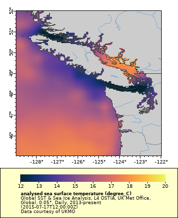

# Data visualization {#graph}

## About "Make A Graph" 

Each ERDDAP dataset has a "Make A Graph" page that allows you to browse data by date and narrow down the spatial range of your of interest.

## Using the control widgets
Make sure you are on the search results page you generated by entering "sst global ostia" in the ERDDAP search box. 


On the OSTIA listing in the search results, click on `"graph"` under "Make A Graph" column. The Make A Graph page for the OSTIA SST dataset will load.


Use the widgets to adjust the map that appears on the right.

* __"Color" widget__ - This widget has a misleading name. Use it to select the variable that displays on the map. By default `"analysed_sst"` is displayed. Click on the dropdown menu to see the other choices. Try selecting `"sea_ice_fraction"` and watch how the map changes. When you are done, reselect `"analysed_sst"`.
* __"time (UTC)" widget__ - Use it to select the date of interest. By default it is set on the most recent date. There are several ways to select a different date.  
    * With the slider bar, pulling the slider all the way to the left takes you to the first date entry in the dataset or any date in between. Take the slider and select a date midway on the slider bar. Click "Redraw the Graph" to display the new map. 
    * On the date display (under the "Stop" column), clicking the minus (`"-"`) or plus (`"+"`) takes you one day back or forward. Clicking the solid blue left-pointing arrow takes you to the first date entry in the dataset. Clicking the solid blue right-pointing arrow takes you to the most recent entry in the dataset. 
    * Try typing a date, e.g. 2018-06-15T12:00:00Z, directly into the date display. Then click "Redraw the Graph".
* __"latitude" and 'longitude' widgets__ - These widgets work like the time widget, except that you can set with minimum and maximum values with the slider, the `"-"` and `"+"` buttons, and the solid blue left- and right-pointing arrows. 
* __"File Type" widget__ - Use it to select the output file type. There are over 30 types to choose from. Some of the most useful for data and image file types are listed below. A full description of file types can be found here: `https://coastwatch.pfeg.noaa.gov/erddap/griddap/documentation.html`
    * .nc - netCDF files
    * .mat - Matlab files
    * .json - JSON format
    * .png, .smallPng, .largePng, transparentPng
    * .geotif
    * .ppdf, .smallPdf, .largePdf

## Setting the area
For this example, select an area off of the Washington coast for July 15, 2015 by doing the following:  

* Put in the following minimum and maximum latitude and longitude values using the widgets.     
    * `Latitudes: 45, 52`
    * `Longitudes: -129, -122`  

* Then click "Redraw the Graph". 
* Next, using the `"time (UTC)"` widget select a time of July 15, 2015 (`2015-07-15T12:00:00Z`). Then click the `"Redraw the Graph"` button.


There is very little difference in the map color, so adjust the map color scale. 

* In the "Graph Settings" under  "Color Bar", 
    * for "Minimum" input `12` 
    * for "Maximum" input `20` 
    * Then click the `"Redraw the Graph"` button


* You can even change the color palette. 
    * Click the dropdown next to `"Color Bar"` to see a selection of palettes. 
    * The palettes beginning with `"KT"` are designed to best show certain parameters and to be compliant with ADA requirements. Select the `KT_thermal palette`, which is designed for temperature maps, and click `"Redraw the Graph"`.  



## Setting the file format

You can request the data in many formats. Find the dropdown box below the "Redraw the Graph" button that is labeled `"File Type"`. Click on the dropdown box to view a list of about 30 file formats. 


* Some of the most useful for data files are:
    * .nc - netCDF files
    * .mat - Matlab files
    * .json - JSON format
* Image files are available, too
    * .png, .smallPng, .largePng, transparentPng
    * .geotif
    * .ppdf, .smallPdf, .largePdf

* A full description of file types can be found here: https://coastwatch.pfeg.noaa.gov/erddap/griddap/documentation.html*

For now, select `".largePng"`

## Download the image

You can download any the of file formats you select by clicking "Download the Data or an image" 

Alternatively, you can copy the URL in the "or view the URL" box. This URL contains the complete request of the data as you defined it. Put the URL in any browser to download the data. You can even send the URL to a colleague and they can download the data. More importantly, you can use the URL to import the data directly into analysis programs like R, Python, or Matlab. 

For this example use an image file. 
* With the `"File Type"` set to `.largePng`, copy the URL in the `"or view the URL"` box. 

* Now open a new browser tab, paste in the URL, and hit return.
* The map should appear as a PNG file in your browser.

__A few tricks__

* You can adjust the way the image looks, e.g. remove the legend, change the size. The documention for this is at this link:  
`https://coastwatch.pfeg.noaa.gov/erddap/griddap/documentation.html#GraphicsCommands`
* If you would like a map like this on a website you are building, just put the URL above into an HTML `` tag. The image will be automatically included on your webpage.


```{r, nice-fig2, echo=FALSE}
htmltools::img(src = knitr::image_uri("cw_logo_notext.png"), 
               alt = 'logo', 
               style = 'position:absolute; top:0; right:0; padding:10px; width:100px')
```
