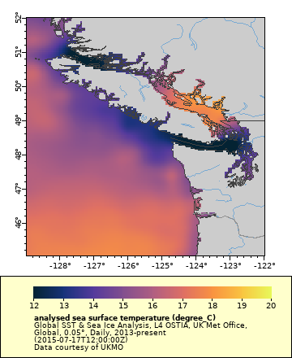
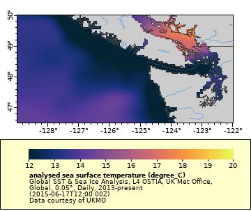

# Deconstructing the URL {#erddap_url}

## URL composition
Copy the following URL and paste it into a simple word processor (not Word). You can paste it into a browser to see what the data look like.
`https://coastwatch.pfeg.noaa.gov/erddap/griddap/jplUKMO_OSTIAv20.largePng?analysed_sst[(2015-07-17T12:00:00Z):(2015-07-17T12:00:00Z)][(45.025):(52.025)][(-128.975):(-121.975)]&.draw=surface&.trim=2&.vars=longitude|latitude|analysed_sst&.colorBar=KT_thermal|||12|20|&.bgColor=0xffccccff`



Try breaking the URL down into its component parts as described below.

* Base URL 
    * `https://coastwatch.pfeg.noaa.gov/erddap/griddap/`  
* dataset ID
    * `jplUKMO_OSTIAv20`
* File type
    * `.largePng`
* Everything after `?` is the data request -> `?`
* Variable of interest
    * `analysed_sst`
* Time
    * `[(2015-07-17T12:00:00Z):(2015-07-17T12:00:00Z)]` 
* Latitude range
    * `[(45.025):(52.025)]`
* Longitude range
    * `[(-128.975):(-121.975)]`
* Everything beginning with `&.draw` adjusts the look of the image  
    * `&.draw=surface&.trim=2&.vars=longitude|latitude|analysed_sst&.colorBar=KT_thermal|||12|20|&.bgColor=0xffccccff`

## Adjust the area data

__NOTE__: You could do the following on the ERDDAP "Make A Graph" page and have ERDDAP generate the modified URL, but we will do it by hand in the browser. 

Change the latitude range to remove Oregon and most of Canada from the map. In the browser, look through the URL and find the part that defines the latitude. Change the lower latitude value from 45.025 to 46.5 and the higher latitude value from 52.025 to 50.0.  

* Change this: `[(45.025):(52.025)]`  
* To this: `[(46.5):(50.0)]`
* Hit return in the browser to see the new edited map.


## Adjust the time

The time is adjusted the similarly to the latitude.

In the browser, look through the URL and find the part that defines the time. Change the both values to be one (1) month earlier.

* Change this: [(2015-07-17T12:00:00Z):(2015-07-17T12:00:00Z)]
* To this: [(2015-06-17T12:00:00Z):(2015-06-17T12:00:00Z)]
* Hit return in the browser to see the new edited map.



ERDDAP allows you to call the most recent image without knowing the date of the most recent data.

In the browser, look through the URL and find the part that defines the time. Change the both values `"last"`.  

* Change this: [(2015-06-17T12:00:00Z):(2015-06-17T12:00:00Z)]  
* To this: [(last):(last)]
* Hit return in the browser to see the new edited map.

:(last)][(46.5):(50.0)][(-128.975):(-121.975)]&.draw=surface&.trim=2&.vars=longitude|latitude|analysed_sst&.colorBar=KT_thermal|||12|20|&.bgColor=0xffccccff)

The image that appears is most recent data. You can even due math while using `"last"`. 
For example, to get the image one week before the most recent image.  

* Change this: [(last):(last)]  
* To this: [(last-7):(last-7)]
* Hit return in the browser to see the new edited map.

You may have to adjust the colorbar minimum and maxium a little. If so, find the part of the URL that defines the colorbar

* colorBar=KT_thermal|||12|20|

The minimun is set to 12 and maximum is st to 20. Play around with the numbers until your image looks good.

```{r, nice-fig2, echo=FALSE}
htmltools::img(src = knitr::image_uri("cw_logo_notext.png"), 
               alt = 'logo', 
               style = 'position:absolute; top:0; right:0; padding:10px; width:100px')
```


